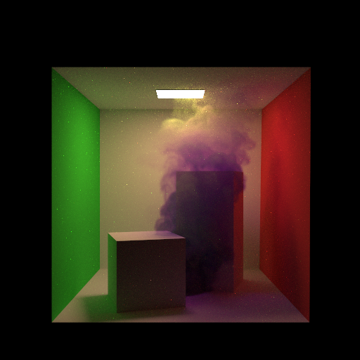
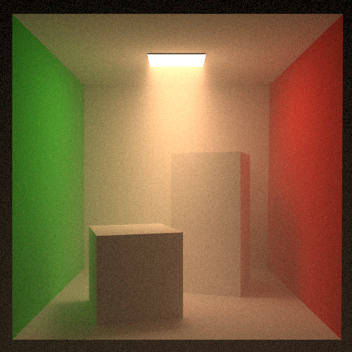
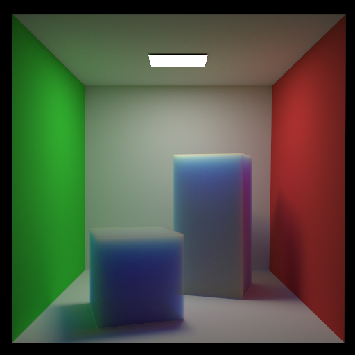
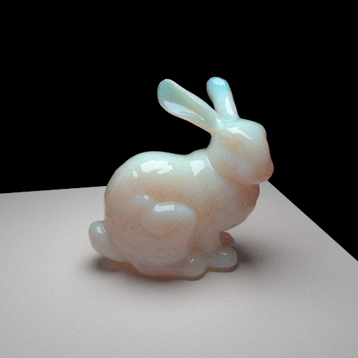
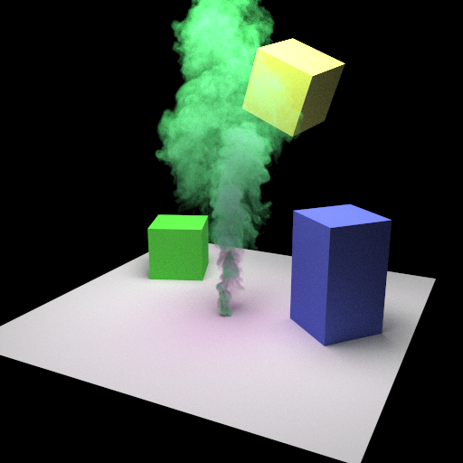

# volpt



Volumetric path tracer written in C++.

WIP.

## Features

* Unidirectional path tracing
* Next event estimation
* Homogeneous medium
* Heterogeneous medium
* [Hero wavelength sampling](https://doi.org/10.1145/3306346.3323025) for chromatic absorption/scattering coefficient
* [Artist friendly parameter](https://doi.org/10.1145/2897839.2927433) to controll absorption/scattering coefficient
* Random walk subsurface scattering
* Ratio tracking
* Load obj model

## Requirements

* C++ (20>=)
* CMake (3.20>=)
* OpenMP
* [spdlog](https://github.com/gabime/spdlog)
* [Embree](https://github.com/embree/embree) (>=3)
* [OpenVDB](https://www.openvdb.org/)

## Build

|CMake option|Description|
|:--|:--|
|BUILD_TESTS|build tests|

```
git submodule update --init
mkdir build
cd build
cmake -DCMAKE_BUILD_TYPE=Release ..
make
```

## Gallery

### Misty cornell box



### Subsurface scattering cornell box



### Subsurface scattering bunny with glass surface



### Smoke cornell box


### Colored smoke



## References

* [Physically Based Rendering:From Theory To Implementation, Matt Pharr, Wenzel Jakob, and Greg Humphreys](https://pbr-book.org/)
* [Wilkie, Alexander, et al. "Hero wavelength spectral sampling." Computer Graphics Forum. Vol. 33. No. 4. 2014.](https://doi.org/10.1111/cgf.12419)
* [Novák, Jan, Andrew Selle, and Wojciech Jarosz. "Residual ratio tracking for estimating attenuation in participating media." ACM Trans. Graph. 33.6 (2014): 179-1.](https://doi.org/10.1145/2661229.2661292)
* [Chiang, Matt Jen-Yuan, Peter Kutz, and Brent Burley. "Practical and controllable subsurface scattering for production path tracing." ACM SIGGRAPH 2016 Talks (2016): 1-2.](https://doi.org/10.1145/2897839.2927433)
* [Fong, Julian, et al. "Production volume rendering: Siggraph 2017 course." ACM SIGGRAPH 2017 Courses. 2017. 1-79.](https://doi.org/10.1145/3084873.3084907)
* [Wrenninge, Magnus, Ryusuke Villemin, and Christophe Hery. Path traced subsurface scattering using anisotropic phase functions and non-exponential free flights. Tech. Rep. 17-07, Pixar. https://graphics. pixar. com/library/PathTracedSubsurface, 2017.](https://graphics.pixar.com/library/PathTracedSubsurface/paper.pdf)
* [Novák, Jan, et al. "Monte Carlo methods for volumetric light transport simulation." Computer Graphics Forum. Vol. 37. No. 2. 2018.](https://doi.org/10.1111/cgf.13383)
* [Miller, Bailey, Iliyan Georgiev, and Wojciech Jarosz. "A null-scattering path integral formulation of light transport." ACM Transactions on Graphics (TOG) 38.4 (2019): 1-13.](https://doi.org/10.1145/3306346.3323025)
* [Georgiev, Iliyan, et al. "Integral formulations of volumetric transmittance." ACM Transactions on Graphics (TOG) 38.6 (2019): 1-17.](https://doi.org/10.1145/3355089.3356559)