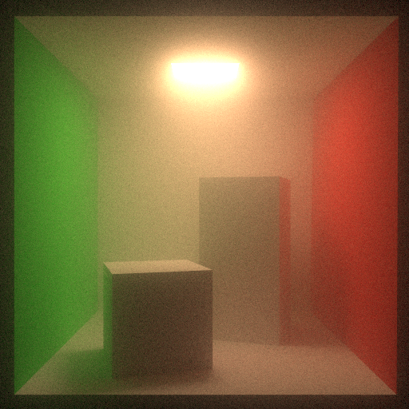

# volpt

Brute force volumetric path tracer written in C++.

WIP.

## Features

* Homogeneous Medium
* Load obj model

## Requirements

* C++ (20>=)
* CMake (3.20>=)
* OpenMP
* [spdlog](https://github.com/gabime/spdlog)
* [Embree](https://github.com/embree/embree) (>=3)

## Build

|CMake option|Description|
|:--|:--|
|BUILD_TESTS|build tests|

```
git submodule update --init
mkdir build
cd build
cmake -DCMAKE_BUILD_TYPE=Release ..
make
```

## Gallery

### glass bunny with homogeneous medium


### Misty cornell box



## Externals

* [spdlog](https://github.com/gabime/spdlog)
* [Embree](https://github.com/embree/embree)
* [tinyobjloader](https://github.com/tinyobjloader/tinyobjloader)

## References

* [Physically Based Rendering:From Theory To ImplementationMatt Pharr, Wenzel Jakob, and Greg Humphreys](https://pbr-book.org/)
* [Fong, Julian, et al. "Production volume rendering: Siggraph 2017 course." ACM SIGGRAPH 2017 Courses. 2017. 1-79.](https://doi.org/10.1145/3084873.3084907)